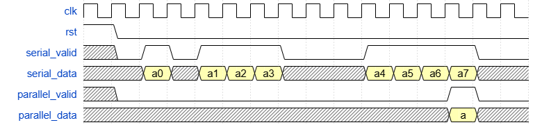

# Домашнее задание №2

Домашнее задание №2 состоит из 8 упражнений.

- Первое упражнение находится в папке `02_01_edge_and_pulse_detection`
- Второе упражнение находится в папке `02_02_single_and_double_rate_fibonacci`
- Третье упражнение находится в папке `02_03_serial_adder_using_logic_operations_only`
- Четвёртое упражнение находится в папке `02_04_serial_adder_with_vld`
- Пятое упражнение находится в папке `02_05_serial_comparator_most_significant_first`
- Шестое упражнение находится в папке `02_06_round_robin_arbiter_with_2_requests`
- Седьмое упражнение находится в папке `02_07_serial_to_parallel`
- Восьмое упражнение находится в папке `02_08_parallel_to_serial`

Каждое упражнение состоит из двух файлов.

Первый файл с самим упражнением. В большинстве упражнений есть секция `Example` с модулем для примера,
и во всех упражнениях есть секция `Task` с описанием задания на английском и местом, где необходимо описать ваше решение.

Второй файл `testbench.sv` содержит набор тестов для проверки корректности вашего решения.

## Предисловие

В процессе работы с упражнениями, можно запустить проверку решения конкретного отдельного задания с помощью команды
`iverilog -g2005-sv *.sv && vvp a.out` в папке нужного задания.

В файле `testbench.sv` любого из заданий можно убрать комментарий у строк `$dumpfile;` и `$dumpvars;` для генерации `dump.vcd` файла. В этом файле будет находится временная диаграмма, описывающая изменения всех проводов и регистров вашего решения во время симуляции.

Можно воспользоваться командой `gtkwave dump.vcd` для просмотра файла, либо добавить опцию `--wave` или `-w` к скрипту `run_linux_mac.sh` или `run_windows.bat`.
Так же, можно использовать более современную программу [Surfer](https://surfer-project.org/) для просмотра временной диаграммы.
Surfer доступен на системах Linux, Windows и macOS, а так же в качестве [расширения редактора VS Code](https://marketplace.visualstudio.com/items?itemName=surfer-project.surfer).

## 01_edge_and_pulse_detection

Реализуйте модуль для детектирования импульсного сигнала. Импульсный сигнал имеет форму `010` на протяжении трёх тактов.

## 02_single_and_double_rate_fibonacci

Реализуйте модуль, который будет генерировать два соседних числа Фибоначчи за такт.

## 03_serial_adder_using_logic_operations_only

Реализуйте модуль для последовательного сумматора, используя только операторы `^` (XOR), `|` (OR), `&` (AND) и `~` (NOT).

Информацию про однобитный полный сумматор можно найти в книге Харрис и Харрис
или на [Википедии](https://en.wikipedia.org/wiki/Adder_(electronics)#Full_adder).

## 04_serial_adder_with_vld

Реализуйте модуль, выполняющий последовательное сложение двух чисел (сложение
одной пары бит за такт). У модуля имеются входы `a` и `b`, выход `sum`.
Также, у модуля есть управляющие сигналы `vld` и `last`.

Сигнал `vld` означает, что входные сигналы валидны. Сигнал `last`
означает, что получены последние биты чисел.

Когда `vld` в 1, модуль должен сложить `a` и `b` и выдать сумму `sum`.
Когда `last` в 1, модуль должен выдать сумму и сбросить свое состояние на
начальное, но только если сигнал `vld` тоже в 1, иначе `last` должен игнорироваться.

Когда `rst` в 1, модуль долен сбросить свое состояние.

## 05_serial_comparator_most_significant_first

Реализуйте модуль для последовательного сравнения двух чисел.

Входы модуля `a` и `b` - это биты двух многобитных чисел `A` и `B`, причем старшие биты чисел идут первыми.
Выходы модуля `a_less_b`, `a_eq_b` и `a_greater_b` должны показывать отношение между числами `A` и `B`.
Модуль также должен учитывать входы `clk` и `rst`.

## 06_round_robin_arbiter_with_2_requests

Реализуйте модуль "арбитра", который принимает до двух запросов
и предоставляет разрешение на работу (grant) одному из запрашивающих.

Модуль должен поддерживать внутренний регистр, который отслеживает,
кто из запрашивающих следующий в очереди на получение гранта.

Временная диаграмма:

## 07_serial_to_parallel

Реализуйте модуль, который преобразует набор последовательных данных
в единое многоразрядное значение.

Модуль должен принимать одноразрядные значения с "valid" интерфейсом последовательным образом.
После накопления `width` битов, модуль должен выставить сигнал `parallel_valid` и выставить данные на шину `parallel_data`.

Временная диаграмма:

## 08_serial_to_parallel

Реализуйте модуль, который преобразует многоразрядное параллельное значение в одноразрядные последовательные данные.

Модуль должен принимать данные с параллельной шины, когда выставляется значение 1 на проводе `parallel_valid`.
В тот же такт, в котором задается значение `parallel_valid`, модуль должен вывести младший бит входных данных.
В последующих тактах модуль должен вывести все оставшиеся биты изначальной `parallel_data`.
Наряду с предоставлением правильного значения `serial_data`, модуль также должен корректно выводить `serial_valid` на каждом такте.

Временная диаграмма:

