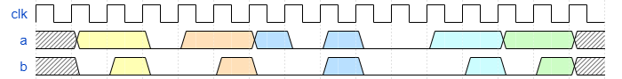
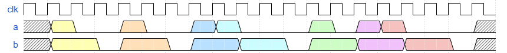
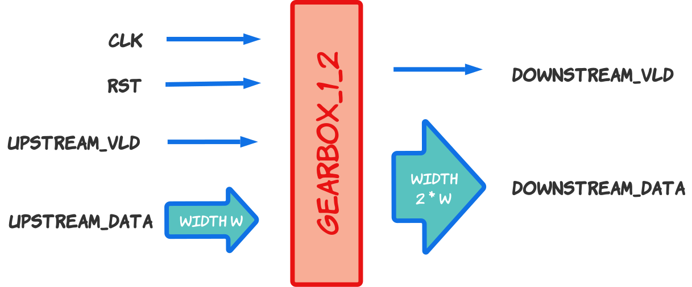
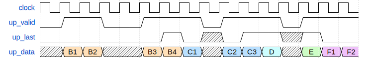
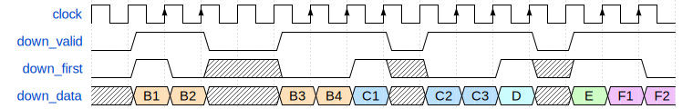
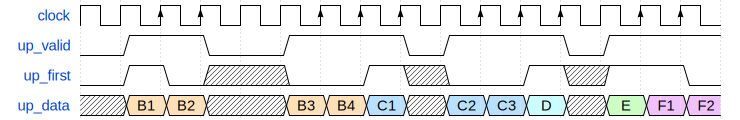
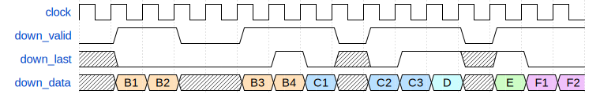

# Домашнее задание №4

Домашнее задание №4 состоит из 6 упражнений:

- Первое в папке `04_01_detect_sequence_using_shift_reg`
- Второе в папке `04_02_halve_tokens`
- Третье в папке `04_03_double_tokens`
- Четвёртое в папке `04_04_gearbox_1_to_2`
- Пятое в папке `04_05_convert_last_to_first_with_valid`
- Шестое в папке `04_06_convert_first_to_last_with_valid`

У первого упражнения есть секция `Example` с модулем для примера,
и во всех упражнениях есть секция `Task` с описанием задания и местом, где необходимо описать ваше решение.

## Предисловие

В процессе работы с упражнениями, возможно запустить проверку решения только одного задания с помощью команды
`iverilog -g2005-sv *.sv && vvp a.out` в папке задания.

Для Linux и MacOS подобных систем, можно воспользоваться скриптом `run_linux_mac.sh` для запуска проверки конкретного задания.

В файле Testbench любого из заданий можно убрать комментарий у строк `$dumpfile;` и `$dumpvars;` для генерации `dump.vcd` файла. В файле будут содержаться текстовые описания временной диаграммы, описывающей изменения на всех проводах и регистрах во время симуляции.

Можно воспользоваться командой `gtkwave dump.vcd` для просмотра файла, либо добавить опцию `--wave` или `-w` к скрипту `run_`.
Так же, возможно использовать более современную программу [Surfer](https://surfer-project.org/) для просмотра временных диаграмм.
Surfer доступен на системах Linux, Windows и macOS, а так же в качестве [расширения редактора VS Code](https://marketplace.visualstudio.com/items?itemName=surfer-project.surfer).

## Упражнение 1. Распознавание двоичной последовательности с помощью регистра сдвига

Ознакомьтесь с примером детектирования 4-х битной последовательности.

Задание: Реализуйте модуль для детектирования 6-ти битной последовательности `110011` используя сдвиговый регистр.

## Упражнение 2. Уполовинивание токенов

Задание: Реализуйте последовательный модуль, который вдвое сократит количество входящих токенов "1" (логических единиц).

Временная диаграмма:

## Упражнение 3. Удвоение токенов

Задание: Реализуйте последовательный модуль, который удваивает каждый входящий токен "1" (логическую единицу).
Модуль должен обрабатывать удвоение как минимум для 200 токенов "1", поступающих подряд.

В случае, если модуль обнаруживает более 200 последовательных токенов "1", он должен выставить
флаг ошибки переполнения. Ошибка переполнения должна быть фиксированной (sticky). Как только ошибка появится, единственный способ ее устранения — использовать сигнал сброса "rst".

Временная диаграмма:

## Упражнение 4. Редуктор 1 в 2

> Альтернативное название: "Трансформатор потока данных из одинарной ширины в двойную"

Задание: Реализуйте модуль, который последовательно принимает два отсчёта данных одинарной длины,
и выдаёт один отсчёт данных двойной длины на каждый второй "валидный" такт.

Модуль должен воспринимать данные как корректные только при сигнале `up_vld`,
и должен сигнализировать корректность данных двойной длины при помощи `down_vld`.

Высокоуровневая архитектурная диаграмма:

## Упражнение 5. Конвертация сигнала конца в сигнал начала

Задание: Реализуйте модуль для конвертации сигнала, обозначающего конец передачи текущего пакета,
в сигнал, сигнализирующий о начале передачи нового пакета.

Содержимое передаваемых данных должно оставаться неизменным.

Временная диаграмма:

## Упражнение 6. Конвертация сигнала начала в сигнал конца

Задание: Реализуйте модуль для конвертации сигнала, обозначающего начало передачи текущего пакета,
в сигнал, сигнализирующий о конце передачи прошлого пакета.

Содержимое передаваемых данных должно оставаться неизменным.

Временная диаграмма:

