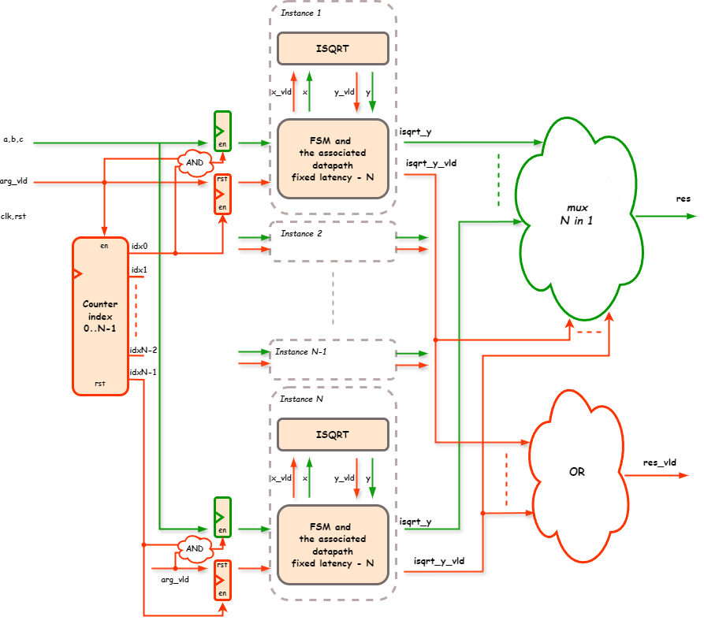
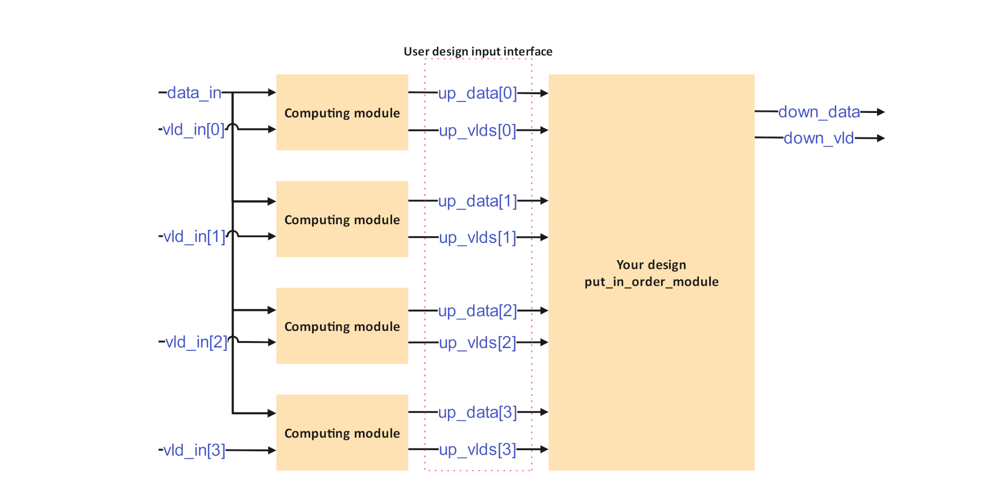
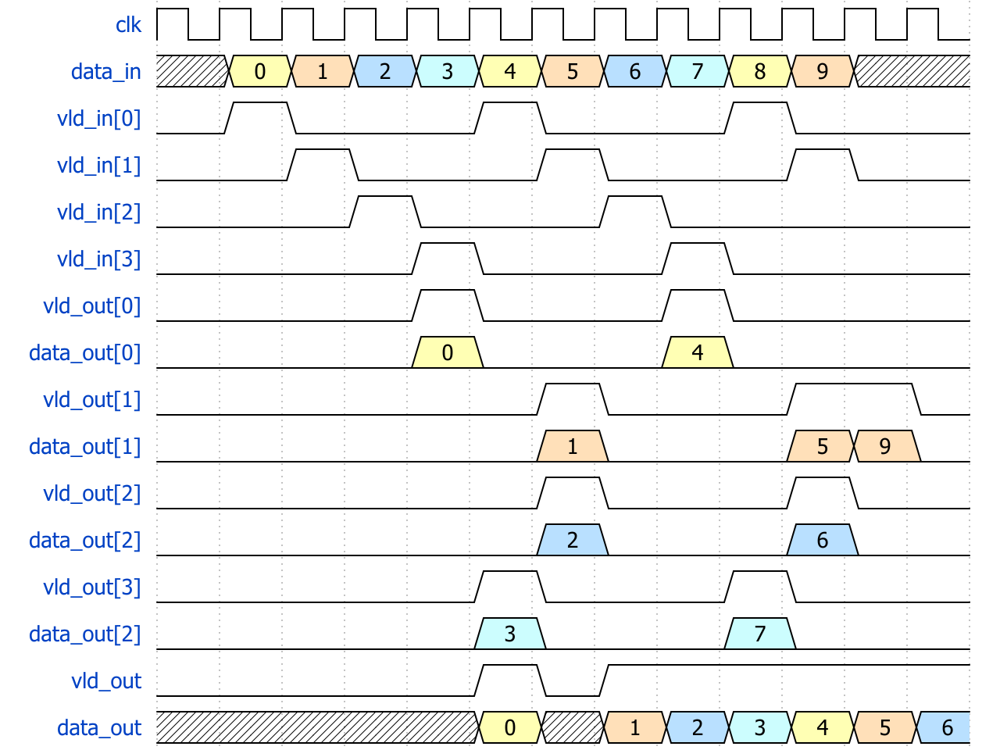

# Практическое Задание №4

Практическое задание №4 состоит из 13 упражнений:

- Первое в папке `04_01_signed_add_with_overflow`
- Второе в папке `04_02_signed_add_with_saturation`
- Третье в папке `04_03_signed_or_unsigned_mul`
- Четвёртое в папке `04_04_four_ways_of_doing_shift`
- Пятое в папке `04_05_circular_shifts`
- Шестое в папке `04_06_arithmetic_shift_or_signed_divide_by_power_of_2`
- С седьмого по десятое в папке `04_07_10_sqrt_formula_pipe`
- Одиннадцатое в папке `04_11_sqrt_formula_distributor`
- Двенадцатое в папке `04_12_float_discriminant_distributor`
- Тринадцатое в папке `04_13_put_in_order`

В большинстве упражнений есть секция `Example` с модулем для примера,
и секция `Task` с описанием задания и местом, где необходимо описать ваше решение.

## Предисловие

В процессе работы с упражнениями 1-6, возможно запустить проверку решения только отдого задания с помощью команды
`iverilog -g2005-sv *.sv && vvp a.out` в папке задания.

В файле содержащем  Testbench любого из заданий можно убрать комментарий у строк `$dumpfile;` и `$dumpvars;` для генерации `dump.vcd` файла. В файле будут содержаться текстовые описания временной диаграммы, описывающей изменения на всех проводах и регистрах во время симуляции.

Можно воспользоваться командой `gtkwave dump.vcd` для просмотра файла, либо добавить опцию `--wave` или `-w` к скрипту `run_`.
Так же, возможно использовать более современную программу [Surfer](https://surfer-project.org/) для просмотра временных диаграмм.
Surfer доступен на системах Linux, Windows и macOS, а так же в качестве [расширения редактора VS Code](https://marketplace.visualstudio.com/items?itemName=surfer-project.surfer).

## Упражнение 1. Знаковое сложение с переполнением

Задание:

Реализуйте модуль, который складывает два числа со знаком и детектирует переполнение.
Под "знаковым числом" мы подразумеваем числа представленные в "дополненном коде" ([two's complement](https://en.wikipedia.org/wiki/Two%27s_complement)).

Выходной бит "переполнения" должен быть равен 1, если значение sum (положительное или отрицательное) двух входных аргументов не помещается в 4 бита.
В противном случае значение "переполнения" должно быть 0.

## Упражнение 2. Знаковое сложение с насыщением

Задание:

Реализуйте модуль, который складывает два знаковых числа с насыщением.
"Сложение с насыщением" означает:
- Если результат не помещается в 4 бита, а аргументы положительные, результирующая сумма должна стать максимальным положительным числом.
- Если результат не помещается в 4 бита, а аргументы отрицательные, результирующая сумма должна стать минимальным отрицательным числом.

## Упражнение 3. Знаковое и беззнаковое умножение

Задание:

Реализуйте параметризованный модуль, который выдает результат умножения
с учётом знаков или без учёта знаков в зависимости от входного бита 'signed_mul'.

## Упражнение 4. Четыре способа побитового сдвига

Задание:

Реализуйте параметризованный модуль, который сдвигает беззнаковое входное число на `S` бит вправо
используя четыре разных способа: логический сдвиг вправо, конкатенацию, цикл `for` внутри `always_comb`,
и цикл `for` внутри `generate`.

## Упражнение 5. Циклический побитовый сдвиг

Задание:

Реализуйте модуль, который сдвигает входящие `S` битов вправо циклически, по кругу,
используя только оператор побитовой конкатенации (фигурные скобки `{` и `}`) и срезы (slice, оператор квадратные скобки `[` и `]`).

"Циклически" означает `ABCDEFGH` -> `FGHABCDE`, когда `N = 8` и `S = 3`.

Во второй подзадаче используйте только следующие операции:
логический сдвиг вправо (`>>`), логический сдвиг влево (`<<`), "или" (`|`) и константы.

## Упражнение 6. Арифметический сдвиг или деление на степень двойки

Задание:

Реализуйте арифметический сдвиг вправо тремя разными способами.
Арифметический сдвиг вправо (`>>>`) отличается от логического сдвига (`>>`) заполнением начальных бит правильным значением, в зависимости от знака.

Например:
`-4` равно `8'b11111100` в дополненном коде, а значит `-4 >>> 2` будет равно `-1` = `8'b11111111`.

## Упражнения 7-10. Конвейерное вычисление формул с квадратным корнем

### Введение

Директория `04_07_10_sqrt_formula_pipe` содержит набор упражнений посвящённый вычислению Формулы 1 и Формулы 2 с использованием квадратных корней в конвейеризованном виде. Это лучшая по производительности версия задания `03_04_05_sqrt_formula_fsms`.

Рекомендуется ознакомиться с обсуждением этого задания в статье Юрия Панчула, опубликованной в Журнале FPGA-Systems :: FSM :: Issue ALFA (state_0).
Выпуск находится по ссылке https://fpga-systems.ru/fsm#state_0.

### Упражнение 7

Задание:

Реализуйте конвейерный модуль `formula_1_pipe`, который вычисляет результат по формуле, определенной в файле `formula_1_fn.svh`.

Требования:
1. Модуль formula_1_pipe должен быть конвейерным
    - Он должен быть способен принимать новый набор аргументов `a`, `b` и `c`, поступающих в каждом такте
    - Он также должен быть способен выдавать новый результат каждый такт с фиксированной латентностью
2. В вашем решении должно быть создано ровно 3 экземпляра конвейерного модуля `isqrt`, каждый из которых будет вычислять целочисленный квадратный корень для своего аргумента.
3. Ваше решение должно экономить динамическое энергопотребление за счет правильного подключения valid сигналов.

Архитектурная диаграмма

### Упражнение 8

Задание:

Реализуйте модуль `formula_1_pipe_aware_fsm` с помощью конечного автомата (FSM), который управляет входными данными и использует выходные данные одного конвейерного модуля `isqrt`.

Предполагается, что модуль `formula_1_pipe_aware_fsm` должен быть создан внутри модуля `formula_1_pipe_aware_fsm_top` вместе с единственным экземпляром `isqrt`.

Результирующая структура должна вычислять формулу, определенную в файле `formula_1_fn.svh`.
Модуль `formula_1_pipe_aware_fsm` не должен создавать никаких экземпляров модуля `isqrt`, он должен использовать только порты ввода и вывода, подключенные к экземпляру `isqrt` на более высоком уровне иерархии экземпляров.

Все вычисления пути передачи данных, за исключением вычисления квадратного корня, должны быть реализованы внутри модуля `formula_1_pipe_aware_fsm`.Таким образом, этот модуль является не только конечным автоматом, но и комбинацией FSM с каналом передачи данных для добавлений и промежуточными регистрами данных.

Обратите внимание, что модуль `formula_1_pipe_aware_fsm` сам по себе не является конвейерным. Он должен быть способен принимать новые аргументы `a`, `b` и `c`, поступающие через каждые `N+3` такта.
Для достижения этой задержки предполагается, что FSM использует факт, что `isqrt` является конвейерным.

Архитектурная диаграмма

### Упражнение 9. Сдвиговый регистр с valid сигналом

Задание:

Реализуйте вариант модуля сдвигового регистра, который перемещает передачу данных только в том случае, если эта передача действительна (сигнал `valid` активен).

Архитектурная диаграмма

### Упражнение 10

Задание:

Реализуйте конвейерный модуль `formula_2_pipe`, который вычисляет результат по формуле, определенной в файле `formula_2_fn.svh`.

Требования:
1. Модуль `formula_2_pipe` должен быть конвейерным.
    - Он должен быть способен принимать новый набор аргументов `a`, `b` и `c`, поступающих в каждом такте.
    - Он также должен быть способен выдавать новый результат каждый такт с фиксированной задержкой после принятия аргументов.
2. В вашем решении должно быть создано ровно 3 экземпляра конвейерного модуля `isqrt`.
3. Ваше решение должно экономить динамическое энергопотребление за счет правильного подключения сигналов валидности.

При правильной конвейерной обработке, выравнивания данных по тактам, используйте модуль `shift_register_with_valid` для создания задержки в
`N` и `2N+1` тактов.

Архитектурная диаграмма

## Упражнение 11. Распределитель вычислений. Формулы с корнями

Задание:

Реализуйте модуль, который будет вычислять Формулу 1 или Формулу 2 на основе значений параметров.
Модуль _должен_ быть конвейерным. Он обязан принимать новую тройку аргументов `a`, `b`, `c`, поступающих в каждом такте.

Идея задания состоит в реализации аппаратного распределитель задач, который будет принимать тройку аргументов и назначать задачу вычисления формулы 1 или формулы 2 с этими аргументами свободному внутреннему модулю из прошлых заданий.
Первым шагом к решению упражнения является заполнение файлов `03_04` и `03_05`.

Примечание 1:  \
Необходимо самостоятельно выяснить задержку в тактах для модуля `formula_1_isqrt` по временной диаграмме.
В случае трудностей с временной диаграммой, можно считать, что она равна 50 тактам.

Примечание 2:  \
Упражнение предполагает идеализированный распределитель (с 50 внутренними вычислительными блоками), однако на практике инженеры редко используют более 10 модулей одновременно. Обычно используют 3-5 блоков и глобальную остановку (stall) в случае высокой нагрузки.

Рекомендация:  \
Создайте достаточное количество модулей "formula_1_impl_1_top", "formula_1_impl_2_top" или "formula_2_top" для достижения желаемой производительности.

Архитектурная диаграмма

Пример работы на временной диаграмме

## Упражнение 12. Распределитель вычислений. Вещественный дискриминант

Задание:

Реализуйте модуль, который будет вычислять дискриминант на основе тройки входных вещественных чисел `a`, `b`, `c`.

Модуль _обязан_ быть конвейерным. Он должен быть способен принимать новую тройку аргументов в каждом тактовом цикле,
а также через некоторое время выдавать результат в каждом такте.

Идея упражнения аналогична упражнению `04_11`. Основное отличие заключается в базовом модуле `03_08_float_discriminant` вместо модулей формул.

Примечание 1:  \
Повторно используйте свой файл "03_08_float_discriminant.sv" из Домашнего задания 3.

Примечание 2:  \
Задержка модуля "float_discriminant" должна быть определена по временной диаграмме.

## Упражнение 13. Упорядочивание результатов

Задание:

Реализуйте модуль, который принимает множество выходных данных с массива вычислительных блоков и выводит их один за другим по порядку.
Входные сигналы `up_vlds` и `up_data` поступают из неконвейерных вычислительных блоков. Эти внешние вычислители имеют переменную задержку.

Порядок входящих `up_vlds` не является фиксированным, при этом задача состоит в том, чтобы выводить `down_vld` и данные по порядку, одни за другими.

Комментарий:  \
Идея блока отчасти похожа на блок `parallel_to_serial` из Домашнего задания 2,
но в данном упражнении блок должен придерживаться правильного порядка вывода.

Архитектурная диаграмма

Пример работы на временной диаграмме

