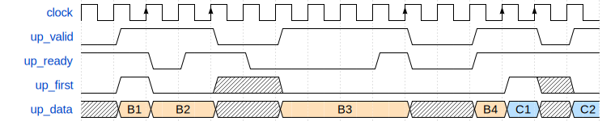
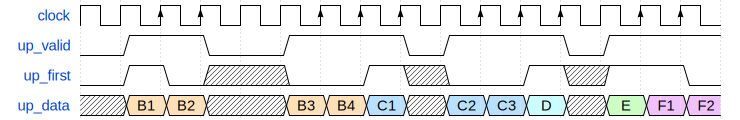
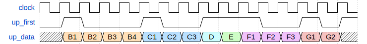
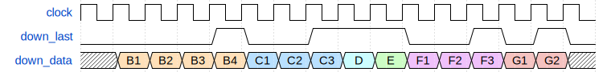

The set for the Mock Verilog Interview at Cal Poly San Luis Obispo

© Yuri Panchul, Verilog Meetup
[https://verilog-meetup.com](https://verilog-meetup.com/) and the
participants to
[systemverilog-homework](https://github.com/verilog-meetup/systemverilog-homework)
open-source project.

To make the mock interview realistic, you cannot use any form of AI, Google
anything or even access the Internet when answering this question. A
candidate usually answers this question on a dry-erase board with no access
to anything electronic.

### Question 01. Convert First to Last

Design a block that works as a filter for a data stream. The stream is
divided into bursts. The upstream bursts are divided using the First flag,
and the downstream bursts are divided using the Last flag. Your block should
figure out how to generate the Last flags from the First flags.

The block uses a Valid/Ready protocol for both upstream and downstream,
consistent with AMBA AXI-Stream Protocol Specification rules:

1. The basic protocol uses three signals: Valid, Ready and Data. They are
sampled on the positive edge of the protocol clock.

2. The transfer is considered to have happened when both Valid and Ready are
sampled high.

3. Valid may turn high some clock cycles before Ready or after Ready, or
they may become high in the same clock cycle.

4. Once a Valid signal is set high, it cannot be set low until the transfer
occurs.

5. Similarly, data should be stable all the time the Valid signal waits for
the Ready signal.

6. The module that drives the Valid signal should not wait for the Ready
signal to turn high before asserting the Valid signal high.

7. The Ready signal should be able to change at any moment without affecting
the functionality of the data transmission.

8. When both Valid and Ready signals are kept high for multiple cycles, the
data transfers in the stream go back-to-back; it is unnecessary to de-assert
either Valid or Ready.

### Question 02. Convert First to Last - a simplified version without Ready

If Question 1 is difficult for you, you can try a simplified version, without Ready:

### Question 03. Convert First to Last - an even more simplified version without both Ready and Valid

You can also start with a version without both Ready and Valid.

### Question 04. A trivial question: convert Last to First

I consider this question too straightforward for job interviews, but you can
try it first if you don't understand how to solve questions 01-03.

### Question 05. Even more trivial question: convert Last to First without Valid, everything is back-to-back

This is as easy as it can go. If you cannot solve this question, please get
a textbook and read about a D-flip-flop.

