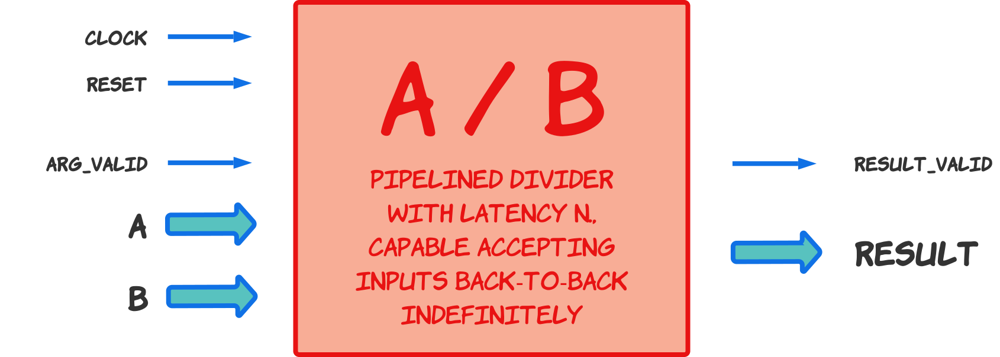
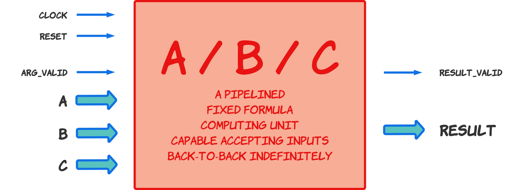
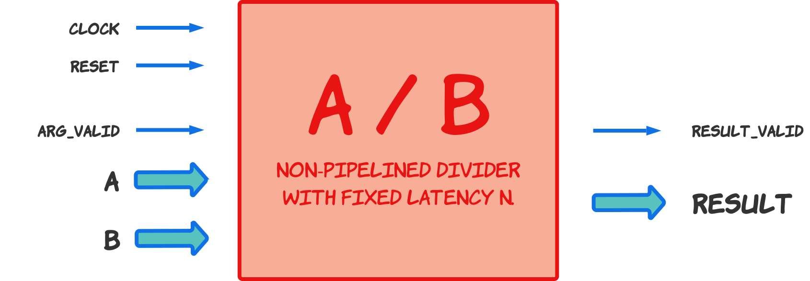
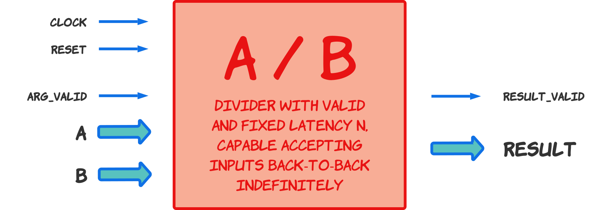
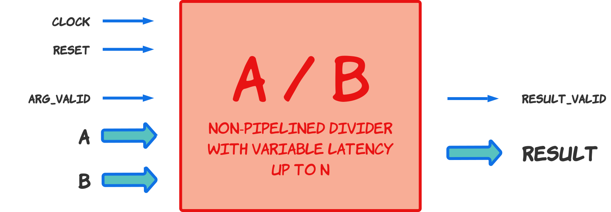
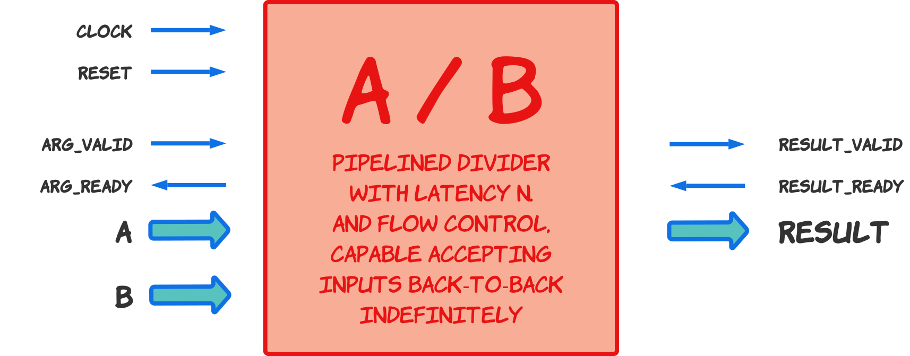
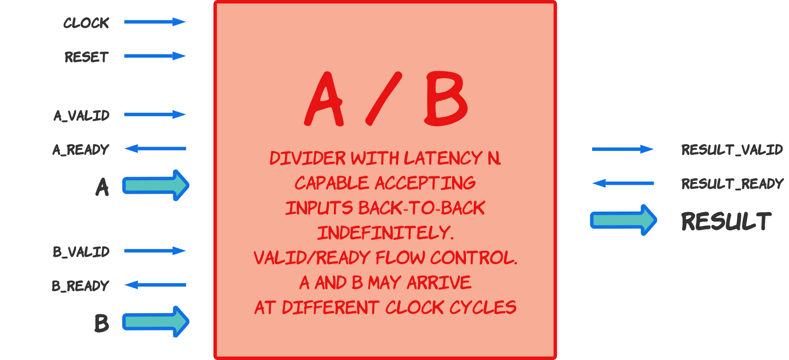

The set for the Mock Verilog Interview at Cal Poly San Luis Obispo

© Yuri Panchul, Verilog Meetup
[https://verilog-meetup.com](https://verilog-meetup.com/) and the
participants to
[systemverilog-homework](https://github.com/verilog-meetup/systemverilog-homework)
open-source project.

To make the mock interview realistic, you cannot use any form of AI, Google
anything or even access the Internet when answering this question. A
candidate usually answers this question on a dry-erase board with no access
to anything electronic.

### Question 31. Pipelined A/B/C out of pipelined A/B

### Question 42. A/B with back-to-back bandwidth out of non-pipelined A/B with fixed latency

### Question 43. A/B with back-to-back bandwidth out of non-pipelined A/B with variable latency

### Question 44. A/B with flow control to handle backpressure

The designed block should use a Valid/Ready protocol for both upstream and
downstream, consistent with AMBA AXI-Stream Protocol Specification rules:

1. The basic protocol uses three signals: Valid, Ready and Data. They are
sampled on the positive edge of the protocol clock.

2. The transfer is considered to have happened when both Valid and Ready are
sampled high.

3. Valid may turn high some clock cycles before Ready or after Ready, or
they may become high in the same clock cycle.

4. Once a Valid signal is set high, it cannot be set low until the transfer
occurs.

5. Similarly, data should be stable all the time the Valid signal waits for
the Ready signal.

6. The module that drives the Valid signal should not wait for the Ready
signal to turn high before asserting the Valid signal high.

7. The Ready signal should be able to change at any moment without affecting
the functionality of the data transmission.

8. When both Valid and Ready signals are kept high for multiple cycles, the
data transfers in the stream go back-to-back; it is unnecessary to de-assert
either Valid or Ready.

### Question 45. A/B with separate flow control for A and B

